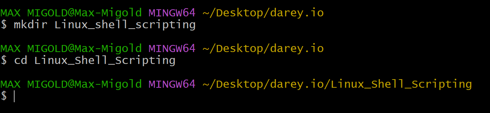
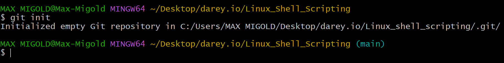
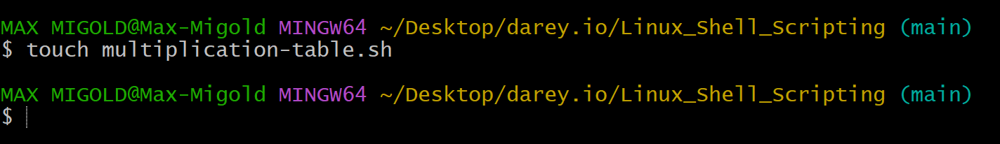
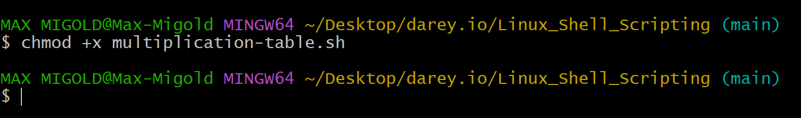
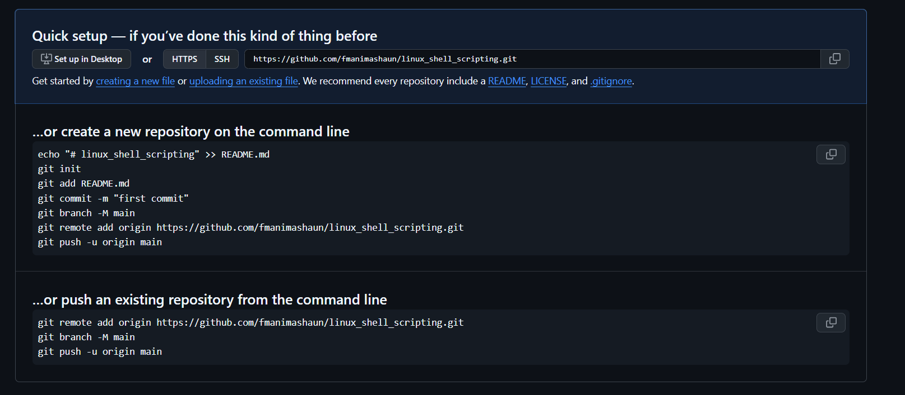
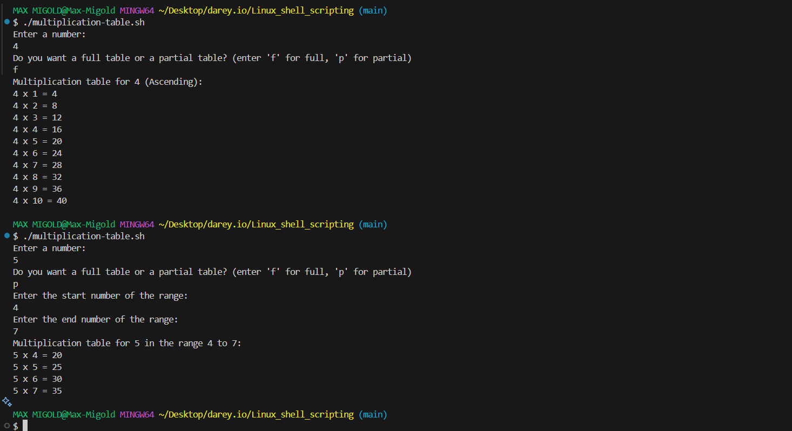

# LINUX SHELL SCRIPTING

## Table of Contents

1. **Project Overview**
2. **Project Steps and Commands**
   - 2.1 [Create Project Directory](#21-create-project-directory)
   - 2.2 [Initialize Git Repository](#22-initialize-git-repository)
   - 2.3 [Create the Bash Script File (.sh)](#23-create-the-bash-script-file-sh)
   - 2.4 [Make the Script Executable](#24-make-the-script-executable)
   - 2.5 [Set Up GitHub Repository and Link Remote](#25-set-up-github-repository-and-link-remote)
3. **Script Implementation Steps**
   - 3.1 [Prompt for User Input](#31-prompt-for-user-input)
   - 3.2 [Ask for Table Type (Full or Partial)](#32-ask-for-table-type-full-or-partial)
   - 3.3 [Full Multiplication Table Using List-Style Loop](#33-full-multiplication-table-using-list-style-loop)
   - 3.4 [Partial Multiplication Table Using List-Style Loop](#34-partial-multiplication-table-using-list-style-loop)
   - 3.5 [Full Multiplication Table Using C-Style Loop](#35-full-multiplication-table-using-c-style-loop)
   - 3.6 [Partial Multiplication Table Using C-Style Loop](#36-partial-multiplication-table-using-c-style-loop)
   - 3.7 [Input Validation and Handling Invalid Options](#37-input-validation-and-handling-invalid-options)
4. **Troubleshooting (Common Issues and Solutions)**
   - 4.1 [Script Permission Denied](#41-script-permission-denied)
   - 4.2 [Invalid Input for Number](#42-invalid-input-for-number)
   - 4.3 [Invalid Range in Partial Table](#43-invalid-range-in-partial-table)
   - 4.4 [Git Remote Connection Issues](#44-git-remote-connection-issues)

---

## 1. Project Overview

This project demonstrates how to create a Bash script that generates a multiplication table for a user-specified number. The script showcases two loop techniques:
- **List-Style For Loop:** Uses sequence expansion or the `seq` command.
- **C-Style For Loop:** Uses the classic C-like loop syntax.

The user can choose between generating a full multiplication table (from 1 to 10) or a partial table over a custom range. The project is version-controlled with Git and pushed to GitHub.

---

## 2. Project Steps and Commands

### 2.1. Create Project Directory
Create a directory to store your project files.
```sh
mkdir linux-shell-scripting
cd linux-shell-scripting
```


### 2.2. Initialize Git Repository
Initialize a Git repository in the project directory.
```sh
git init
```


### 2.3. Create the Bash Script File (.sh)
Create a shell script file named `multiplication_table.sh`.
```sh
touch multiplication_table.sh
```


### 2.4. Make the Script Executable
Grant execution permissions to the script.
```sh
chmod +x multiplication_table.sh
```


### 2.5. Set Up GitHub Repository and Link Remote
Create a new repository on GitHub and link your local repository to it.
```sh
git remote add origin <repository_url>
```


---

## 3. Script Implementation Steps

### 3.1. Prompt for User Input
Prompt the user to enter the number for which the multiplication table will be generated.
```sh
echo "Enter a number:"
read number
```

### 3.2. Ask for Table Type (Full or Partial)
Ask whether the user wants a full table (1 to 10) or a partial table with a custom range.
```sh
echo "Do you want a full table or partial table? (Enter 'f' for full, 'p' for partial)"
read table_type
```

### 3.3. Full Multiplication Table Using List-Style Loop
If the user selects the full table option using list-style loops:
```sh
if [ "$table_type" == "f" ]; then
    echo "Multiplication table for $number (List-style, Ascending):"
    for i in {1..10}
    do
        result=$((number * i))
        echo "$number x $i = $result"
    done
```

### 3.4. Partial Multiplication Table Using List-Style Loop
For a partial table, prompt the user for a range and then use a list-style loop:
```sh
elif [ "$table_type" == "p" ]; then
    echo "Enter the start number of the range:"
    read start
    echo "Enter the end number of the range:"
    read end
    if [ "$start" -le "$end" ]; then
        echo "Multiplication table for $number from $start to $end (List-style):"
        for i in $(seq $start $end)
        do
            result=$((number * i))
            echo "$number x $i = $result"
        done
```

### 3.5. Full Multiplication Table Using C-Style Loop
Alternatively, here’s how to implement the full multiplication table using a C-style for loop:
```sh
    echo "Multiplication table for $number (C-style, Ascending):"
    for (( i=1; i<=10; i++ ))
    do
        result=$((number * i))
        echo "$number x $i = $result"
    done
```

### 3.6. Partial Multiplication Table Using C-Style Loop
Similarly, for a partial table with a custom range using a C-style loop:
```sh
    echo "Multiplication table for $number from $start to $end (C-style):"
    for (( i=start; i<=end; i++ ))
    do
        result=$((number * i))
        echo "$number x $i = $result"
    done
```
*Note: Ensure that the range validation (start ≤ end) is performed before using the loops.*

### 3.7. Input Validation and Handling Invalid Options
Add error handling for invalid inputs and ranges.
```sh
    else
        echo "Invalid range. The start number must be less than or equal to the end number."
    fi
else
    echo "Invalid option. Please enter 'f' for full table or 'p' for partial table."
fi
```



---

## 4. Troubleshooting (Common Issues and Solutions)

### 4.1. Script Permission Denied
- **Issue:** Running the script may return a “Permission Denied” error.
- **Solution:** Ensure the script is executable:
  ```sh
  chmod +x multiplication_table.sh
  ```

### 4.2. Invalid Input for Number
- **Issue:** Non-numeric input can cause unexpected behavior.
- **Solution:** Add input validation:
  ```sh
  if ! [[ "$number" =~ ^[0-9]+$ ]]; then
      echo "Invalid input. Please enter a valid number."
      exit 1
  fi
  ```

### 4.3. Invalid Range in Partial Table
- **Issue:** The start number is greater than the end number.
- **Solution:** Verify the range before generating the table:
  ```sh
  if [ "$start" -gt "$end" ]; then
      echo "Invalid range. The start number must be less than or equal to the end number."
      exit 1
  fi
  ```

### 4.4. Git Remote Connection Issues
- **Issue:** Problems pushing code to GitHub.
- **Solution:** Check your remote URL:
  ```sh
  git remote -v
  ```
  If necessary, re-add the remote:
  ```sh
  git remote add origin <repository_url>
  ```